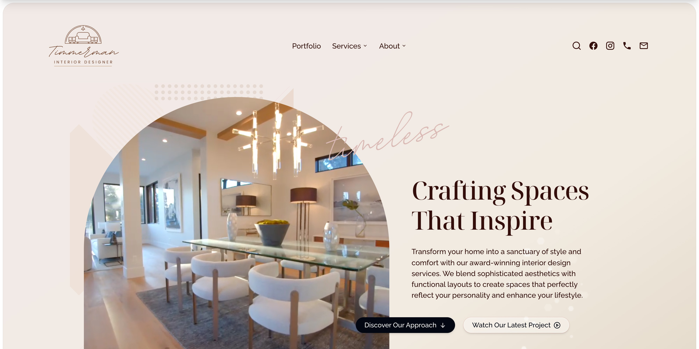

# Speedwell

[](https://speedwell.gallop.software)

**A Next.js template for small businesses featuring high-quality feminine design.** Build and deploy a professional small business website with speed and get highly ranked on Google. Manage content and images with AI using Gallop software. No CMS required.

**🌐 Demo:** [speedwell.gallop.software](https://speedwell.gallop.software)  
**📦 Repository:** [github.com/gallop-software/speedwell](https://github.com/gallop-software/speedwell)

---

## About Gallop Templates

Speedwell is part of the [Gallop](https://gallop.software) template ecosystem, designed specifically to work seamlessly with AI assistants like GitHub Copilot, Claude, and ChatGPT. Built with an opinionated codebase optimized for AI efficiency, Gallop templates enable you to:

- **Build websites with AI** - Let AI do the technical heavy lifting while you provide instructions
- **Pixel-perfect design** - TailwindCSS integration for rapid development without leaving component files
- **Automate workflows** - AI-powered scripts for sitewide SEO improvements, image regeneration, and content updates
- **Get found online** - Battle-tested SEO foundation with structured data for search engines and AI models
- **Deploy instantly** - Next.js architecture on Vercel for cheap, fast hosting

Gallop templates are trusted by professionals achieving #1 Google rankings in competitive search terms like "dallas architects," "lubbock attorneys," and "birth center."

---

## Features

- 🚀 **Next.js 16.0** with App Router
- ⚛️ **React 19.2** for cutting-edge performance
- 🎨 **Tailwind CSS 4.1** for pixel-perfect design
- 📝 **TSX-powered content** - No CMS required
- 🖼️ **Image processing** with automatic optimization
- 🔍 **Built-in search** powered by FlexSearch
- 📱 **Fully responsive** and mobile-optimized
- ⚡ **Lightning-fast** performance
- 🎭 **Framer Motion** animations
- 🎯 **SEO-optimized** with structured data
- 🤖 **AI-friendly** codebase structure
- 📊 **Vercel Analytics** integration

---

## Quick Start

### Installation

```bash
npm install
```

### Development

```bash
npm run dev
```

Open [http://localhost:3000](http://localhost:3000) to view your site.

### Build for Production

```bash
npm run build
npm run start
```

---

## Project Structure

```
speedwell/
├── src/
│   ├── app/                    # Next.js App Router
│   │   ├── [[...slug]]/       # Dynamic catch-all routes
│   │   ├── api/               # API routes
│   │   ├── block/             # Block preview routes
│   │   ├── category/          # Category pages
│   │   ├── layout.tsx         # Root layout
│   │   ├── metadata.tsx       # Site metadata
│   │   └── not-found.tsx      # 404 page
│   ├── blocks/                # Reusable content blocks
│   │   ├── hero-*.tsx         # Hero sections
│   │   ├── section-*.tsx      # Content sections
│   │   ├── call-to-action-*.tsx
│   │   ├── contact-*.tsx
│   │   └── ...
│   ├── components/            # React components
│   │   ├── navbar/
│   │   ├── footer/
│   │   └── ui/
│   ├── content/              # Page content (TSX files)
│   ├── hooks/                # Custom React hooks
│   ├── styles/               # Global styles & fonts
│   │   ├── fonts/           # Font files & management
│   │   └── globals.css
│   ├── template/             # Page templates
│   ├── tools/                # Utility tools
│   ├── types/                # TypeScript types
│   └── utils/                # Helper functions
├── public/
│   ├── originals/            # Source images (not deployed)
│   ├── images/               # Processed images
│   ├── videos/               # Video assets
│   └── speedwell.jpg         # Featured image
├── _data/                    # Generated metadata
│   ├── _meta.json           # Image metadata
│   └── _fonts/              # Font configurations
├── _scripts/                 # Automation scripts
│   ├── process-images.js
│   ├── generate-blog-metadata.mjs
│   ├── generate-favicon.js
│   ├── generate-featured-image.js
│   └── generate-search.sh
└── _docs/                    # Documentation
```

---

## Available Scripts

### Development

- **`npm run dev`** - Start development server at http://localhost:3000
- **`npm run build`** - Build for production (runs blog metadata first)
- **`npm run start`** - Start production server
- **`npm run lint`** - Run ESLint checks

### Content & Assets

- **`npm run images`** - Process images from `public/originals/` to responsive variants → [docs](./_docs/process-images.md)
- **`npm run images:reset`** - Delete processed images and regenerate all
- **`npm run blog`** - Generate blog post metadata to `_data/_blog.json` → [docs](./_docs/generate-blog-metadata.md)
- **`npm run search`** - Build FlexSearch index for site search → [docs](./_docs/generate-search.md)
- **`npm run favicon`** - Generate favicon files from `public/originals/favicon.png` → [docs](./_docs/generate-favicon.md)
- **`npm run featured-image`** - Screenshot homepage for social preview → [docs](./_docs/generate-featured-image.md)

### Fonts

- **`npm run fonts`** - Convert TTF fonts to WOFF2 → [docs](./_docs/compressFonts.md)
- **`npm run fonts:use`** - Mark fonts as used in project

### Environment

- **`npm run env`** - Push local `.env.local` to Vercel
- **`npm run env:prod`** - Push to production environment
- **`npm run env:prev`** - Push to preview environment

### Package Management

- **`npm run update:check`** - Check for package updates
- **`npm run update:patch`** - Update to latest patch versions
- **`npm run update:minor`** - Update to latest minor versions
- **`npm run update:major`** - Update to latest major versions
- **`npm run update:interactive`** - Interactively choose updates
- **`npm run update:doctor`** - Update and test changes incrementally

### Maintenance

- **`npm run clean`** - Remove node_modules, .next, and package-lock.json
- **`npm run clean:install`** - Clean and reinstall all dependencies

---

## Deployment

Deploy to Vercel with one click:

[](https://vercel.com/new/clone?repository-url=https://github.com/gallop-software/speedwell)

Or manually:

```bash
npm run build
vercel --prod
```

**See [Deployment Guide](./_docs/deployment.md) for other platforms and configuration.**

---

## Technologies

### Frontend (Runtime)

Packages shipped to production, loaded in the browser:

- **Next.js** `16.0.7` - React framework with App Router
- **React** `19.2.1` - UI library
- **Tailwind CSS** `4.1.17` - Utility-first CSS framework
- **Framer Motion** `12.23.25` - Animation library
- **Headless UI** `2.2.9` - Unstyled accessible components
- **Swiper** `12.0.3` - Modern slider/carousel
- **FlexSearch** `0.8.212` - Full-text search
- **React Highlight Words** `0.21.0` - Text highlighting
- **Yet Another React Lightbox** `3.25.0` - Image gallery
- **Valtio** `2.2.0` - State management
- **Vercel Analytics** `1.6.1` - Analytics integration
- **Next Third Parties** `16.0.7` - Third-party script optimization
- **Algolia Autocomplete** `1.19.4` - Search autocomplete
- **Vimeo Player** `2.30.1` - Video player integration
- **DayJS** `1.11.19` - Date formatting

### Development

Tools for building and developing the site:

- **TypeScript** `5` - Type safety and IntelliSense
- **ESLint** `9` - Code linting
- **Prettier** `3.7.4` - Code formatting
- **PostCSS** `8.5.6` - CSS transformations

### Scripts & Processing

Build-time tools for content and asset generation:

- **Sharp** `0.34.5` - Image processing and optimization
- **Puppeteer** `24.32.0` - Screenshot generation (featured images)
- **ttf2woff2** `8.0.0` - Font compression
- **jsdom** `27.2.0` - HTML parsing for search indexing
- **xml2js** `0.6.2` - XML/RSS feed generation

---

## Support & Community

- **Documentation:** [gallop.software](https://gallop.software)
- **Issues:** [GitHub Issues](https://github.com/gallop-software/speedwell/issues)
- **Slack:** [Join Community](https://join.slack.com/t/gallop-software/shared_invite/zt-358q3rdrp-H6kKvKzpR2qgB5xJviAOcw)
- **Professional Services:** [Web Plant Media, LLC](https://webplant.media)

---

## License

MIT License - see [LICENSE](./LICENSE) for details

---

## Credits

**Contributors:**

- [Chris Baldelomar](https://github.com/webplantmedia)
- [Niel Wostan](https://github.com/NielWostan)

Built with ❤️ by the team at [Gallop](https://gallop.software)

---

## Learn More

- [Next.js Documentation](https://nextjs.org/docs)
- [Tailwind CSS Documentation](https://tailwindcss.com/docs)
- [Gallop Templates](https://gallop.software/templates)
- [React Documentation](https://react.dev)
