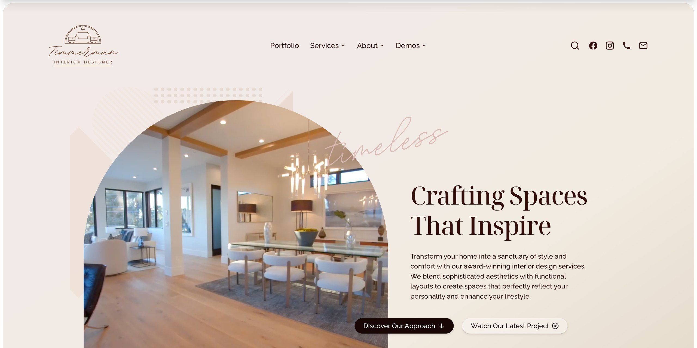

# Speedwell

[](https://speedwell.gallop.software)

An artistic website template for creatives and small businesses who want to build at the speed of thought with AI, look more professional than the competition, and rank #1 on Google.

**🌐 Demo:** [speedwell.gallop.software](https://speedwell.gallop.software)  
**🎨 Template:** [gallop.software/templates](https://gallop.software/templates)  
**📦 Repository:** [github.com/gallop-software/speedwell-pro](https://github.com/gallop-software/speedwell-pro)  
**🏷️ Category:** Small Business Template

---

## Why Use Gallop Templates?

Just chat with AI inside your code editor using our Gallop templates, and you will never want to design a site with WordPress again. Simply describe what you want, and AI writes the code. No CMS, no page builders, no endless options fields, and no design limitations. Just type and watch. Build fun and cute custom layouts, add smooth animations, configure your SEO and AI discoverability instantly, expand endlessly, and get prompting tips from our [Gallop community](https://gallop-software.slack.com/). Go live in minutes.

---

## Features

- 🚀 **Next.js 16.2** with App Router
- ⚛️ **React 19** for cutting-edge performance
- 🎨 **Tailwind CSS 4.2** for pixel-perfect design
- 📝 **TSX-powered content** - No CMS required
- 🖼️ **Image processing** with automatic optimization
- 🔍 **Built-in search** powered by FlexSearch
- 📱 **Fully responsive** and mobile-optimized
- ⚡ **Lightning-fast** performance
- 🎭 **Framer Motion** animations
- 🎯 **SEO and AI optimized** with structured data
- 🤖 **AI-friendly** codebase structure
- 🛡️ **Gallop Canon** - AI guardrails for consistent, reliable code
- 📊 **Vercel Analytics** integration

---

## Getting Started

New to this? No problem. You'll have AI guiding you the entire way. Choose your editor below and follow the steps.

### Choose Your Editor

We recommend the **Gallop AI Editor** for the best experience with Gallop templates — whether you're a beginner or an advanced Next.js developer who wants AI-assisted development. It was purpose-built for this workflow and requires zero configuration. VS Code is also a fine choice if you prefer to work without AI assistance.

| | Gallop AI Editor | VS Code |
|---|---|---|
| **Best for** | Non-programmers, junior programmers, advanced programmers | Advanced programmers |
| **AI built in** | Yes — Claude AI ready to go | No (optional extensions available) |
| **AI setup requirement** | Enter Claude API keys | Install extensions manually |
| **Template browser** | Built-in marketplace | Download ZIP from GitHub |
| **Media manager** | Built-in Studio with CDN sync | Manual file management |
| **Font manager** | Built-in Studio with WOFF2 font generation | No support |
| **SEO Audit** | Analyze SEO & Sturctured Data | No support |
| **Git** | Better Git UI with modal diff viewer | Default Git UI |
| **Node.js** | Built-in installer and version manager | Install Node.js separately |

---

### Option A: Gallop AI Editor (Recommended)

The Gallop AI Editor is a desktop app built specifically for AI-powered web development for Next.js. It includes everything you need — code editor, AI assistant, Git, terminal, media manager, font manager, SEO & structured data scanner, and a template marketplace — all in one window with nothing to configure.

[](https://gallop.software/)

Available for Mac and Windows.

#### Step 1: Install Gallop AI Editor

1. Go to [gallop.software](https://gallop.software/) and download the installer for your platform
2. Open the installer and follow the prompts
3. Launch the Gallop AI Editor
4. If prompted, the editor will walk you through installing Node.js automatically — just follow the on-screen steps

#### Step 2: Open This Template

**From the built-in template marketplace:**

1. Click the **Templates** tab in the sidebar
2. Find **Speedwell** and click **Clone**
3. Choose a folder on your computer (like your Desktop)
4. The editor will download and set up the project for you

**Or from a ZIP download:**

1. Click the green **Code** button at the top of this GitHub page, then click **Download ZIP**
2. Unzip the folder somewhere easy to find (like your Desktop)
3. In the Gallop AI Editor, click **Open Project** and select the unzipped `speedwell` folder

#### Step 3: Start the Dev Server

1. Click the **Terminal** tab at the bottom of the editor
2. Click **Install** to install dependencies, then click **Start** to run the dev server
3. Open [http://localhost:3000](http://localhost:3000) in your browser to see your site

#### Step 4: Chat with AI

Click the **AI Chat** panel (or press `Cmd+E` on Mac / `Ctrl+E` on Windows) to open the AI assistant. Now just ask:

```
I'm new to this. Help me customize this website for my business.
```

The AI assistant can read and edit your project files, run commands, and explain anything you're confused about. Just describe what you want in plain English:

```
Change the homepage heading to Welcome to My Bakery
```

```
Make the accent color pink
```

```
Add a new page called Services
```

```
Optimize the SEO on my homepage
```

**Tip:** Press `Cmd+Ctrl+3` (Mac) to take a screenshot of your running site and attach it to the chat. The AI can see exactly what you see and suggest changes visually.

---

### Option B: VS Code

VS Code is a good choice if you prefer to work without AI assistance. You'll need to install a few things manually.

[](https://code.visualstudio.com)

#### Step 1: Install Prerequisites

1. Install [VS Code](https://code.visualstudio.com)
2. Install [Node.js](https://nodejs.org) (version 20 or higher)

#### Step 2: Download This Template

Click the green **Code** button at the top of this GitHub page, then click **Download ZIP**. Unzip the folder somewhere easy to find (like your Desktop).

#### Step 3: Open in VS Code

1. Open VS Code
2. Click **File → Open Folder**
3. Select the unzipped `speedwell` folder
4. Click **Open**

#### Step 4: Install and Run

Open the terminal in VS Code (`Ctrl+`` ` on Mac/Windows) and run:

```bash
npm install
npm run dev
```

Open [http://localhost:3000](http://localhost:3000) to see your site. Press `Ctrl+C` to stop the server.

#### Step 5: Start Building

Edit files directly in VS Code. Refer to the [Project Structure](#project-structure) and [Available Scripts](#available-scripts) sections below for guidance.

---

### Join the Community

Connect with other Gallop users on Slack. Share your progress, swap AI prompting tips, and see how non-programmers are building websites that once required a seasoned software engineer.

[](https://gallop-software.slack.com/)

---

## Put Your Site Online

When you're ready to share your site with the world, you'll need a free [GitHub](https://github.com) account to store your code and a free [Vercel](https://vercel.com) account to host your site.

### The Easy Way

Just ask your AI assistant:

```
Help me create a GitHub account, push this project to GitHub, and deploy to Vercel
```

The AI will walk you through every step. When you're done, your site will be live with a URL you can share.

### For Technical Users

If you're comfortable with Git:

#### Step 1: Create Your Repository

[](https://github.com/gallop-software/speedwell-pro/generate)

#### Step 2: Clone Your Repository

Ask your AI assistant:

```
Help me clone my new GitHub repository and run it locally
```

Or run these commands in your terminal:

```bash
git clone https://github.com/YOUR-USERNAME/YOUR-REPO-NAME.git
cd YOUR-REPO-NAME
npm install
npm run dev
```

Open [http://localhost:3000](http://localhost:3000) to view your site. Press `Ctrl+C` to stop the server. When ready to test production, run `npm run build` then `npm start`.

#### Step 3: Deploy to Vercel

[](https://vercel.com/new/clone?demo-title=Speedwell&demo-description=An%20artistic%20website%20template%20for%20creatives%20and%20small%20businesses%20who%20want%20to%20build%20at%20the%20speed%20of%20thought%20with%20AI%2C%20look%20more%20professional%20than%20the%20competition%2C%20and%20rank%20%231%20on%20Google.&demo-url=https%3A%2F%2Fspeedwell.gallop.software&demo-image=https%3A%2F%2Fspeedwell.gallop.software%2Fimages%2Fscreenshot-md.jpg&from=templates&project-name=speedwell-pro&repository-name=speedwell-pro&repository-url=https%3A%2F%2Fgithub.com%2Fgallop-software%2Fspeedwell-pro)

Select your repository, and Vercel will automatically deploy whenever you push changes.

Congratulations! Your site is now live to the world. Share your new URL and start growing your business online. Ready for a custom domain? See [Vercel's domain setup guide](https://vercel.com/docs/projects/domains).

### Speedwell Pro

Want access to all 117 blocks including premium designs? [Purchase Speedwell Pro](https://gallop.software/code/speedwell/blocks#pricing) and clone from the Pro repository, which includes all Pro blocks ready to use.

---

## About Gallop Templates

Speedwell is part of the [Gallop](https://gallop.software) template ecosystem. Gallop templates are designed to be built with AI — just describe what you want in plain English and watch your site come to life.

### Gallop AI Editor

The [Gallop AI Editor](https://gallop.software/) is a desktop code editor built specifically for AI-powered web development. It combines a full code editor, Claude AI assistant, visual Git interface, integrated terminal, media manager, and template marketplace into one app. Everything is preconfigured to work with Gallop templates out of the box — no extensions, no plugins, no setup.

**Key highlights:**

- **Claude AI built in** — Chat with Claude to write code, debug issues, and learn as you go. Supports Opus 4.6, Sonnet 4.6, and Haiku 4.5 models
- **Agent and Plan modes** — Agent mode lets AI apply changes automatically. Plan mode shows you what AI wants to do before it does it, so you stay in control
- **Screenshot capture** — Press `Cmd+Ctrl+3` to screenshot your running site and share it with AI for visual feedback
- **Built-in template marketplace** — Browse and clone Gallop templates without leaving the editor
- **Visual Git** — Stage, commit, and merge with a 3-column visual interface. No command line required
- **Studio media manager** — Manage images, fonts, and assets with thumbnail previews and CDN sync
- **Node.js manager** — Install and switch Node.js versions without touching the terminal
- **Auto-updates** — The editor keeps itself up to date automatically

### Gallop Canon: AI Guardrails

Every Gallop template includes `@gallop.software/canon`, a system of ESLint rules and AI instructions that keep your AI assistant on track. Canon ensures:

- **Consistent architecture** - AI follows the same patterns across your entire codebase
- **No breaking changes** - Guardrails prevent AI from introducing common mistakes
- **Faster development** - AI already knows the project structure, components, and conventions
- **Quality code** - Enforced best practices for performance, SEO, AI discoverability, and maintainability

Think of Canon as training wheels that never come off. AI stays within proven patterns, so you get reliable results every time.

**Canon Commands:**

- `npm run check` - Run lint, TypeScript, and unused checks together
- `npm run generate:ai-rules` - Regenerate AI rules from Canon
- `npm run update:canon` - Update to latest Canon version

### Built for SEO and AI Discoverability

This template was crafted from the ground up to get your business website ranked #1 on Google and mentioned by AI assistants like ChatGPT and Google's Gemini. The software architecture, semantic HTML structure, metadata system, and structured data are optimized for both search engine crawlers and AI models that recommend businesses to users.

AI mentions are becoming more important than traditional SEO. When someone asks an AI assistant for recommendations, you want your business in that answer. Gallop templates are built with the structured data and semantic markup that AI models rely on to understand and recommend your business. Businesses using this template are already ranking on Google and getting discovered by AI assistants.

### What You Can Build

- **Build websites with AI** - Let AI do the technical heavy lifting while you provide instructions
- **Skip the boring work** - Let AI help write your content, optimize your SEO, and handle tedious page updates
- **Pixel-perfect design** - TailwindCSS integration for rapid development without leaving component files
- **Automate workflows** - AI-powered scripts for sitewide SEO and AI discoverability improvements, image regeneration, and content updates
- **Get found online** - Battle-tested foundation with structured data for search engines and AI assistants that recommend businesses
- **Deploy instantly** - Next.js architecture on Vercel for cheap, fast hosting

### Built by Industry Veterans

The [team](https://webplant.media) behind Gallop has decades of combined experience building websites, apps, and web applications for top global brands. We've helped businesses achieve #1 Google rankings in competitive markets and understand what it takes to build world class business websites. That expertise is baked into every template, every component, and every line of code.

---

## Project Structure

```
speedwell/
├── src/
│   ├── app/                    # Next.js App Router
│   │   ├── (default)/         # Default layout route group
│   │   │   ├── layout.tsx     # Default navbar layout
│   │   │   ├── category/      # Category pages
│   │   │   └── .../           # Other page routes
│   │   ├── (hero)/            # Hero layout route group
│   │   │   ├── layout.tsx     # Hero navbar layout
│   │   │   ├── page.tsx       # Home page
│   │   │   ├── testimonials/  # Testimonials page
│   │   │   └── .../           # Other hero pages
│   │   ├── (post)/            # Blog post route group
│   │   │   ├── layout.tsx     # Post layout with gradient
│   │   │   └── post/[slug]/   # Dynamic blog posts
│   │   ├── (demo)/            # Demo/preview route group
│   │   │   └── block/         # Block preview routes
│   │   ├── (one-page-site)/   # Single-page layout group
│   │   ├── (alternate)/       # Alternate navbar group
│   │   ├── (hero-dark)/       # Hero dark layout group
│   │   ├── (color-navbar)/    # Colored navbar group
│   │   ├── api/               # API routes
│   │   ├── sitemap_index.xml/ # Sitemap generation
│   │   ├── global-error.tsx    # Error boundary
│   │   ├── global-not-found.tsx # 404 page
│   │   ├── layout.tsx         # Root layout
│   │   ├── metadata.tsx       # Site metadata
│   │   ├── robots.ts          # Robots.txt config
│   │   ├── sitemap.ts         # Sitemap config
│   │   ├── README.md          # Layouts documentation
│   │   └── *.png, *.ico       # App icons and favicon
│   ├── blog/                  # Blog post content (TSX files)
│   ├── components/            # React components
│   │   ├── navbar/           # Main navigation
│   │   ├── navbar-2/         # Alternate navigation
│   │   ├── navbar-3/         # Third navigation variant
│   │   ├── blog/             # Blog components
│   │   ├── search/           # Search components
│   │   ├── lightbox/         # Lightbox gallery
│   │   ├── page-wrapper.tsx  # Page wrapper with structured data
│   │   ├── accordion.tsx
│   │   ├── button.tsx
│   │   ├── card-*.tsx
│   │   ├── footer.tsx
│   │   ├── gallery.tsx
│   │   ├── heading.tsx
│   │   ├── image.tsx
│   │   ├── logo.tsx
│   │   ├── section.tsx
│   │   └── ...
│   ├── fonts/                # Font configuration files
│   │   ├── accent.ts        # Accent font config
│   │   ├── body.ts          # Body font config
│   │   ├── heading.ts       # Primary heading font
│   │   ├── heading2.ts      # Secondary heading font
│   │   └── heading3.ts      # Tertiary heading font
│   ├── hooks/                # Custom React hooks
│   ├── styles/               # Global styles
│   │   └── tailwind.css     # Tailwind CSS entry
│   ├── tools/                # Utility tools
│   ├── utils/                # Helper functions
│   └── state.ts              # Global state management
├── public/
│   ├── blocks/               # Block preview screenshots
│   ├── originals/            # Source images (not deployed)
│   │   ├── portfolio/
│   │   └── profiles/
│   ├── images/               # Processed images
│   │   ├── portfolio/
│   │   └── profiles/
│   ├── videos/               # Video assets
│   ├── search-index.json     # FlexSearch index
│   └── screenshot.jpg        # Featured image
├── _fonts/                   # Font source files (managed by Studio)
│   ├── barlow/              # Barlow font family
│   │   ├── barlow-regular.ttf
│   │   ├── barlow-regular.woff2
│   │   └── ...
│   ├── montserrat/          # Montserrat font family
│   ├── opensans/            # Open Sans font family
│   ├── poppins/             # Poppins font family
│   └── .../                 # Other font families
├── _data/                    # Generated metadata
│   ├── _blog.json           # Blog metadata
│   └── _studio.json         # Studio/image metadata
├── _scripts/                 # Build scripts
│   ├── generate-blog-metadata.mjs
│   ├── generate-search.mjs
│   └── ...
├── next.config.mjs          # Next.js configuration
├── tsconfig.json            # TypeScript config
├── postcss.config.js        # PostCSS config
├── package.json             # Dependencies & scripts
├── knip.config.js           # Unused file detection config
├── eslint.config.mjs        # ESLint config
└── .prettierrc              # Prettier config
```

---

## Available Scripts

### Development

- **`npm run dev`** - Start development server at http://localhost:3000
- **`npm run build`** - Build for production (runs blog metadata first)
- **`npm run start`** - Start production server
- **`npm run lint`** - Run ESLint on all source files
- **`npm run lint:file`** - Run ESLint on a specific file
- **`npm run lint:gallop`** - Run Gallop Canon lint rules on blocks
- **`npm run ts`** - TypeScript type checking without emitting
- **`npm run prettier`** - Format all files with Prettier
- **`npm run unused`** - Find unused files with knip
- **`npm run check`** - Run lint, TypeScript, and unused checks

### Gallop Canon

- **`npm run audit`** - Audit codebase with Gallop Canon
- **`npm run audit:strict`** - Strict audit mode
- **`npm run audit:json`** - Output audit results as JSON

### Content & Assets

- **`npm run blog`** - Generate blog post metadata to `_data/_blog.json` → [docs](./_scripts/generate-blog-metadata.md)
- **`npm run search`** - Build FlexSearch index for site search → [docs](./_scripts/generate-search.md)
- **`npm run blocks`** - Generate blocks catalog with screenshots
- **`npm run blocks:screenshots`** - Force regenerate all block screenshots
- **`npm run blocks:sort`** - Sort blocks in catalog
- **`npm run layouts`** - Generate layouts catalog from app route groups
- **`npm run layouts:screenshots`** - Force regenerate all layout screenshots
- **`npm run layouts:sort`** - Sort layouts in catalog

### Environment

- **`npm run env`** - Push `.env.production` to Vercel → [docs](./_scripts/push-env-to-vercel.md)
- **`npm run env:prod`** - Push to production environment
- **`npm run env:prev`** - Push to preview environment

### Package Management

- **`npm run update:check`** - Check for package updates
- **`npm run update:patch`** - Update to latest patch versions
- **`npm run update:minor`** - Update to latest minor versions
- **`npm run update:major`** - Update to latest major versions
- **`npm run update:interactive`** - Interactively choose updates
- **`npm run update:doctor`** - Update and test changes incrementally

### Maintenance

- **`npm run refresh`** - Remove node_modules and .next, then reinstall
- **`npm run clean`** - Remove node_modules, .next, and package-lock.json, then reinstall

---

## Technologies

### Frontend (Runtime)

Every dependency is battle-tested in production and chosen for stability, performance, and long-term maintainability.

- **Next.js** `16.2.1` - React framework with App Router
- **React** `19` - UI library
- **Tailwind CSS** `4.2.2` - Utility-first CSS framework
- **Headless UI** `2.2.9` - Unstyled accessible components
- **Valtio** `2.3.1` - State management
- **Swiper** `12.1.3` - Modern slider/carousel
- **Yet Another React Lightbox** `3.30.1` - Image gallery
- **FlexSearch** `0.8.212` - Full-text search
- **Algolia Autocomplete** `1.19.7` - Search autocomplete
- **Vimeo Player** `2.30.3` - Video player integration
- **Framer Motion** `12.38.0` - Animation library
- **Luxon** `3.7.2` - DateTime library
- **React Intersection Observer** `10.0.3` - Scroll-based animations and lazy loading
- **React Highlight Words** `0.21.0` - Text highlighting
- **Iconify Icons** - Icon sets (Heroicons, Lucide, Material Design)
- **clsx** `2.1.1` - Conditional className utility
- **React DOM** `19.2.4` - React rendering
- **Vercel Analytics** `1.6.1` - Analytics integration
- **Next Third Parties** `16.2.1` - Third-party script optimization

### Development

Tools for building and developing the site:

- **TypeScript** `5` - Type safety and IntelliSense
- **ESLint** `9` - Code linting
- **Prettier** `3.8.1` - Code formatting
- **Prettier Plugin Organize Imports** `4.3.0` - Auto-organize imports
- **Prettier Plugin Tailwindcss** `0.7.2` - Sort Tailwind classes
- **PostCSS** `8.5.8` - CSS transformations
- **Gallop Canon** `2.33.0` - ESLint rules and AI rules generator

### Scripts & Processing

Build-time tools for content and asset generation:

- **Sharp** `0.34.5` - Image processing and optimization
- **Puppeteer** `24.40.0` - Screenshot generation (featured images)
- **jsdom** `27.4.0` - DOM parsing for search index generation
- **@sindresorhus/slugify** `3.0.0` - URL-friendly slugs for search indexing
- **xml2js** `0.6.2` - XML/RSS feed generation

---

## Support & Community

- **Documentation:** [gallop.software](https://gallop.software)
- **Issues:** [GitHub Issues](https://github.com/gallop-software/speedwell-pro/issues)
- **Slack:** [Join Community](https://join.slack.com/t/gallop-software/shared_invite/zt-358q3rdrp-H6kKvKzpR2qgB5xJviAOcw)
- **Professional Services:** [Web Plant Media, LLC](https://webplant.media)

---

## License

MIT License - see [LICENSE](./LICENSE) for details

---

## Credits

**Contributors:**

- [Chris Baldelomar](https://github.com/webplantmedia)
- [Niel Wostan](https://github.com/NielWostan)
- [Rabpreet Singh](https://github.com/Rabpreet1233)

Built with ❤️ by the team at [Gallop](https://gallop.software)

---

## Learn More

- [Gallop AI Editor](https://gallop.software/)
- [Gallop Templates](https://gallop.software/templates)
- [Next.js Documentation](https://nextjs.org/docs)
- [Tailwind CSS Documentation](https://tailwindcss.com/docs)
- [React Documentation](https://react.dev)
