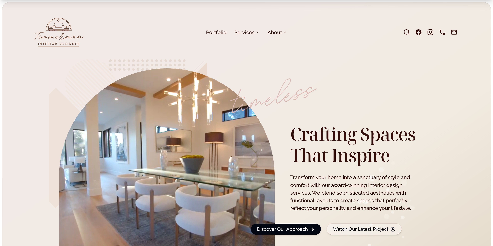

# Speedwell

[](https://speedwell.gallop.software)

The premier feminine website template for women-owned businesses who want to build at the speed of thought, look more professional than the competition, and rank #1 on Google.

Just chat with Claude AI inside [Cursor](https://cursor.com) text editor using our Gallop templates, and you will never want to design a site with WordPress again. Simply describe what you want, and it writes the code. No CMS, no page builders, no endless options fields, and no design limitations. Just type and watch. Build fun and cute custom layouts, add smooth animations, configure your SEO and AI discoverability instantly, expand endlessly, and get prompting tips from our Gallop community. Go live in minutes.

**🌐 Demo:** [speedwell.gallop.software](https://speedwell.gallop.software)  
**🎨 Template:** [gallop.software/templates](https://gallop.software/templates)  
**📦 Repository:** [github.com/gallop-software/speedwell](https://github.com/gallop-software/speedwell)  
**🏷️ Category:** Small Business Template

---

## Getting Started

New to this? No problem. You'll have Claude AI guiding you the entire way.

### Step 1: Install Cursor

[Download Cursor](https://cursor.com) for your computer (Mac or Windows). This is where you'll chat with Claude AI to build your site.

### Step 2: Download This Template

Click the green **Code** button at the top of this page, then click **Download ZIP**. Unzip the folder somewhere easy to find (like your Desktop).

### Step 3: Open in Cursor

1. Open Cursor
2. Click **File → Open Folder**
3. Select the unzipped `speedwell` folder
4. Click **Open**

### Step 4: Ask Claude AI for Help

Press `Cmd+L` (Mac) or `Ctrl+L` (Windows) to open the chat panel. Now just ask:

> _"I'm new to this. Help me get this website running on my computer."_

Claude will walk you through everything, including installing any tools you need. Just follow along and ask questions whenever you're stuck.

### Step 5: Start Building

Once your site is running, you can describe any changes you want:

- _"Change the homepage heading to Welcome to My Bakery"_
- _"Make the accent color pink"_
- _"Add a new page called Services"_
- _"Optimize the SEO on my homepage"_

### Join the Community

Connect with other Gallop users on Slack. Share your progress, swap AI prompting tips, and see how non-programmers are building websites that once required a seasoned software engineer.

<a href="https://gallop-software.slack.com/" target="_blank"></a>

---

## Put Your Site Online

When you're ready to share your site with the world, you'll need a free [GitHub](https://github.com) account to store your code and a free [Vercel](https://vercel.com) account to host your site.

### The Easy Way

Just ask Claude AI:

> _"Help me create a GitHub account, push this project to GitHub, and deploy to Vercel"_

Claude will walk you through every step. When you're done, your site will be live with a URL you can share.

### For Technical Users

If you're comfortable with Git:

1. **Create your own repository** from the Speedwell template:

   [](https://github.com/gallop-software/speedwell/generate)

2. **Clone your new repository** to your computer. Ask Claude AI:

   > _"Help me clone my new GitHub repository and run it locally"_

   Or run these commands in your terminal:

```bash
git clone https://github.com/YOUR-USERNAME/YOUR-REPO-NAME.git
cd YOUR-REPO-NAME
npm install
npm run dev
```

3. **Deploy to Vercel:**

   [](https://vercel.com/new)

   Select your repository, and Vercel will automatically deploy whenever you push changes.

Congratulations! Your site is now live to the world. Share your new URL and start growing your business online. Ready for a custom domain? See [Vercel's domain setup guide](https://vercel.com/docs/projects/domains).

### Speedwell Pro

Want access to all 117 blocks including premium designs? [Purchase Speedwell Pro](https://gallop.software/code/speedwell/blocks#pricing) and clone from the Pro repository, which includes all Pro blocks ready to use.

---

## About Gallop Templates

Speedwell is part of the [Gallop](https://gallop.software) template ecosystem, built for [Cursor](https://cursor.com) and Claude AI. Cursor is Gallop's preferred AI programming editor, purpose-built for coding with AI. VSCode works too, but Cursor's native Claude integration makes development faster and more intuitive.

**Why Claude?** Claude is the premier coding AI agent. It understands context better, writes cleaner code, and handles complex multi-file changes that other AI models struggle with. When you chat with Claude in Cursor, you're working with the best AI pair programmer available.

### Gallop Canon: AI Guardrails

Every Gallop template includes `@gallop.software/canon`, a system of ESLint rules and AI instructions that keep Claude on track. Canon ensures:

- **Consistent architecture** - Claude follows the same patterns across your entire codebase
- **No breaking changes** - Guardrails prevent AI from introducing common mistakes
- **Faster development** - Claude already knows the project structure, components, and conventions
- **Quality code** - Enforced best practices for performance, SEO, AI discoverability, and maintainability

Think of Canon as training wheels that never come off. Claude stays within proven patterns, so you get reliable results every time.

### Built for SEO and AI Discoverability

This template was crafted from the ground up to get your business website ranked #1 on Google and mentioned by AI assistants like ChatGPT and Google's Gemini. The software architecture, semantic HTML structure, metadata system, and structured data are optimized for both search engine crawlers and AI models that recommend businesses to users.

AI mentions are becoming more important than traditional SEO. When someone asks an AI assistant for recommendations, you want your business in that answer. Gallop templates are built with the structured data and semantic markup that AI models rely on to understand and recommend your business. This is a proven foundation that delivers real traffic and real customers.

### What You Can Build

- **Build websites with AI** - Let AI do the technical heavy lifting while you provide instructions
- **Pixel-perfect design** - TailwindCSS integration for rapid development without leaving component files
- **Automate workflows** - AI-powered scripts for sitewide SEO and AI discoverability improvements, image regeneration, and content updates
- **Get found online** - Battle-tested foundation with structured data for search engines and AI assistants that recommend businesses
- **Deploy instantly** - Next.js architecture on Vercel for cheap, fast hosting

---

## Features

- 🚀 **Next.js 16.1** with App Router
- ⚛️ **React 19** for cutting-edge performance
- 🎨 **Tailwind CSS 4.1** for pixel-perfect design
- 📝 **TSX-powered content** - No CMS required
- 🖼️ **Image processing** with automatic optimization
- 🔍 **Built-in search** powered by FlexSearch
- 📱 **Fully responsive** and mobile-optimized
- ⚡ **Lightning-fast** performance
- 🎭 **Framer Motion** animations
- 🎯 **SEO and AI optimized** with structured data
- 🤖 **AI-friendly** codebase structure
- 📊 **Vercel Analytics** integration

---

## Quick Start

### Installation

```bash
npm install
```

### Development

```bash
npm run dev
```

Open [http://localhost:3000](http://localhost:3000) to view your site.

### Build for Production

```bash
npm run build
npm run start
```

---

## Project Structure

```
speedwell/
├── src/
│   ├── app/                    # Next.js App Router
│   │   ├── (default)/         # Default layout route group
│   │   │   ├── layout.tsx     # Default navbar layout
│   │   │   ├── category/      # Category pages
│   │   │   └── .../           # Other page routes
│   │   ├── (hero)/            # Hero layout route group
│   │   │   ├── layout.tsx     # Hero navbar layout
│   │   │   ├── page.tsx       # Home page
│   │   │   ├── testimonials/  # Testimonials page
│   │   │   └── .../           # Other hero pages
│   │   ├── (post)/            # Blog post route group
│   │   │   ├── layout.tsx     # Post layout with gradient
│   │   │   └── post/[slug]/   # Dynamic blog posts
│   │   ├── (demo)/            # Demo/preview route group
│   │   │   └── block/         # Block preview routes
│   │   ├── (one-page-site)/   # Single-page layout group
│   │   ├── (alternate)/       # Alternate navbar group
│   │   ├── (color-navbar)/    # Colored navbar group
│   │   ├── api/               # API routes
│   │   ├── sitemap_index.xml/ # Sitemap generation
│   │   ├── error.tsx          # Error boundary
│   │   ├── layout.tsx         # Root layout
│   │   ├── metadata.tsx       # Site metadata
│   │   ├── not-found.tsx      # 404 page
│   │   ├── sitemap.ts         # Sitemap config
│   │   ├── README.md          # Layouts documentation
│   │   └── *.png, *.ico       # App icons and favicon
│   ├── blog/                  # Blog post content (TSX files)
│   ├── blocks/                # Reusable content blocks
│   │   ├── hero-*.tsx         # Hero sections (1-19)
│   │   ├── content-*.tsx      # Content sections (1-46)
│   │   ├── section-*.tsx      # Section layouts (1-10)
│   │   ├── call-to-action-*.tsx  # CTAs (1-7)
│   │   ├── testimonial-*.tsx  # Testimonials (1-9)
│   │   ├── form-*.tsx         # Form sections (1-7)
│   │   ├── cover-*.tsx        # Cover sections (1-7)
│   │   ├── archive-*.tsx      # Archive layouts (1-3)
│   │   ├── about-*.tsx        # About sections (1-3)
│   │   ├── pricing-*.tsx      # Pricing sections (1-2)
│   │   ├── process-*.tsx      # Process sections (1)
│   │   ├── sidebar-*.tsx      # Sidebar sections (1)
│   │   └── README.md          # Blocks documentation
│   ├── components/            # React components
│   │   ├── navbar/           # Main navigation
│   │   ├── navbar-2/         # Alternate navigation
│   │   ├── navbar-3/         # Third navigation variant
│   │   ├── blog/             # Blog components
│   │   ├── search/           # Search components
│   │   ├── lightbox/         # Lightbox gallery
│   │   ├── page-wrapper.tsx  # Page wrapper with structured data
│   │   ├── accordion.tsx
│   │   ├── button.tsx
│   │   ├── card-*.tsx
│   │   ├── footer.tsx
│   │   ├── gallery.tsx
│   │   ├── heading.tsx
│   │   ├── image.tsx
│   │   ├── logo.tsx
│   │   ├── section.tsx
│   │   └── ...
│   ├── hooks/                # Custom React hooks
│   ├── styles/               # Global styles & fonts
│   │   ├── fonts/           # Font files & management
│   │   └── globals.css
│   ├── tools/                # Utility tools
│   ├── types/                # TypeScript types
│   ├── utils/                # Helper functions
│   └── state.ts              # Global state management
├── public/
│   ├── blocks/               # Block preview screenshots
│   ├── originals/            # Source images (not deployed)
│   │   ├── portfolio/
│   │   └── profiles/
│   ├── images/               # Processed images
│   │   ├── portfolio/
│   │   └── profiles/
│   ├── videos/               # Video assets
│   ├── search-index.json     # FlexSearch index
│   └── speedwell.jpg         # Featured image
├── _data/                    # Generated metadata
│   ├── _blog.json           # Blog metadata
│   ├── _meta.json           # Image metadata
│   ├── _meta-old.json       # Backup metadata
│   ├── _fonts/              # Font configurations
│   │   ├── _accent.tsx
│   │   ├── _body.tsx
│   │   ├── _heading.tsx
│   │   ├── _heading2.tsx
│   │   └── _heading3.tsx
│   └── _import/             # Import utilities
├── _scripts/                 # Automation scripts
│   ├── process-images.js    # Image optimization
│   ├── generate-blog-metadata.mjs
│   ├── generate-blocks-catalog.mjs
│   ├── generate-favicon.js
│   ├── generate-featured-image.js
│   ├── push-env-to-vercel.sh # Push env vars to Vercel
│   ├── generate-search.mjs
│   ├── generate-search.sh
│   ├── compress-fonts.js
│   ├── convert-pro-blocks.mjs
│   └── *.md                 # Script documentation
├── next.config.mjs          # Next.js configuration
├── tsconfig.json            # TypeScript config
├── postcss.config.js        # PostCSS config
├── package.json             # Dependencies & scripts
├── knip.config.js           # Unused file detection config
├── .prettierrc              # Prettier config
└── .eslintrc.json           # ESLint config
```

---

## Available Scripts

### Development

- **`npm run dev`** - Start development server at http://localhost:3000
- **`npm run build`** - Build for production (runs blog metadata first)
- **`npm run start`** - Start production server
- **`npm run lint`** - Run ESLint on all source files
- **`npm run lint:file`** - Run ESLint on a specific file
- **`npm run lint:gallop`** - Run Gallop Canon lint rules on blocks
- **`npm run ts`** - TypeScript type checking without emitting
- **`npm run prettier`** - Format all files with Prettier
- **`npm run unused`** - Find unused files with knip
- **`npm run check`** - Run lint, TypeScript, and unused checks

### Gallop Canon

- **`npm run audit`** - Audit codebase with Gallop Canon
- **`npm run audit:strict`** - Strict audit mode
- **`npm run audit:json`** - Output audit results as JSON
- **`npm run generate:ai-rules`** - Generate AI rules for Cursor and Copilot

### Content & Assets

- **`npm run images`** - Process images from `public/originals/` to responsive variants
- **`npm run images:reset`** - Delete processed images and regenerate all
- **`npm run blog`** - Generate blog post metadata to `_data/_blog.json` → [docs](./_scripts/generate-blog-metadata.md)
- **`npm run search`** - Build FlexSearch index for site search → [docs](./_scripts/generate-search.md)
- **`npm run favicon`** - Generate favicon files from `public/originals/favicon.png` → [docs](./_scripts/generate-favicon.md)
- **`npm run featured-image`** - Screenshot homepage for social preview → [docs](./_scripts/generate-featured-image.md)
- **`npm run blocks`** - Generate blocks catalog with screenshots
- **`npm run blocks:screenshots`** - Force regenerate all block screenshots
- **`npm run blocks:sort`** - Sort blocks in catalog
- **`npm run blocks:lite`** - Convert pro blocks → [docs](./_scripts/convert-pro-blocks.md)
- **`npm run layouts`** - Generate layouts catalog from app route groups
- **`npm run layouts:screenshots`** - Force regenerate all layout screenshots
- **`npm run layouts:sort`** - Sort layouts in catalog

### Fonts

- **`npm run fonts`** - Convert TTF fonts to WOFF2 → [docs](./_scripts/compress-fonts.md)
- **`npm run fonts:use`** - Mark fonts as used in project

### Environment

- **`npm run env`** - Push `.env.production` to Vercel → [docs](./_scripts/push-env-to-vercel.md)
- **`npm run env:prod`** - Push to production environment
- **`npm run env:prev`** - Push to preview environment

### Package Management

- **`npm run update:check`** - Check for package updates
- **`npm run update:patch`** - Update to latest patch versions
- **`npm run update:minor`** - Update to latest minor versions
- **`npm run update:major`** - Update to latest major versions
- **`npm run update:interactive`** - Interactively choose updates
- **`npm run update:doctor`** - Update and test changes incrementally
- **`npm run update:canon`** - Update Gallop Canon package

### Maintenance

- **`npm run refresh`** - Remove node_modules and .next, then reinstall
- **`npm run clean`** - Remove node_modules, .next, and package-lock.json, then reinstall

---

## Technologies

### Frontend (Runtime)

Every dependency is battle-tested in production and chosen for stability, performance, and long-term maintainability.

- **Next.js** `16.1.4` - React framework with App Router
- **React** `19` - UI library
- **Tailwind CSS** `4.1.18` - Utility-first CSS framework
- **Headless UI** `2.2.9` - Unstyled accessible components
- **Valtio** `2.3.0` - State management
- **Swiper** `12.0.3` - Modern slider/carousel
- **Yet Another React Lightbox** `3.28.0` - Image gallery
- **FlexSearch** `0.8.212` - Full-text search
- **Algolia Autocomplete** `1.19.4` - Search autocomplete
- **Vimeo Player** `2.30.1` - Video player integration
- **Framer Motion** `12.29.0` - Animation library
- **DayJS** `1.11.19` - Date formatting
- **Luxon** `3.7.2` - DateTime library
- **React Intersection Observer** `10.0.2` - Scroll-based animations and lazy loading
- **React Highlight Words** `0.21.0` - Text highlighting
- **Iconify Icons** - Icon sets (Heroicons, Lucide, Material Design)
- **clsx** `2.1.1` - Conditional className utility
- **React DOM** `19.2.3` - React rendering
- **Vercel Analytics** `1.6.1` - Analytics integration
- **Next Third Parties** `16.1.4` - Third-party script optimization

### Development

Tools for building and developing the site:

- **TypeScript** `5` - Type safety and IntelliSense
- **ESLint** `9` - Code linting
- **Prettier** `3.8.1` - Code formatting
- **Prettier Plugin Organize Imports** `4.3.0` - Auto-organize imports
- **Prettier Plugin Tailwindcss** `0.7.2` - Sort Tailwind classes
- **PostCSS** `8.5.6` - CSS transformations
- **Gallop Canon** `2.16.1` - ESLint rules and AI rules generator

### Scripts & Processing

Build-time tools for content and asset generation:

- **Sharp** `0.34.5` - Image processing and optimization
- **Puppeteer** `24.36.0` - Screenshot generation (featured images)
- **ttf2woff2** `8.0.0` - Font compression
- **jsdom** `27.4.0` - DOM parsing for search index generation
- **@sindresorhus/slugify** `3.0.0` - URL-friendly slugs for search indexing
- **xml2js** `0.6.2` - XML/RSS feed generation

---

## Support & Community

- **Documentation:** [gallop.software](https://gallop.software)
- **Issues:** [GitHub Issues](https://github.com/gallop-software/speedwell/issues)
- **Slack:** [Join Community](https://join.slack.com/t/gallop-software/shared_invite/zt-358q3rdrp-H6kKvKzpR2qgB5xJviAOcw)
- **Professional Services:** [Web Plant Media, LLC](https://webplant.media)

---

## License

MIT License - see [LICENSE](./LICENSE) for details

---

## Credits

**Contributors:**

- [Chris Baldelomar](https://github.com/webplantmedia)
- [Niel Wostan](https://github.com/NielWostan)
- [Rabpreet Singh](https://github.com/Rabpreet1233)

Built with ❤️ by the team at [Gallop](https://gallop.software)

---

## Learn More

- [Next.js Documentation](https://nextjs.org/docs)
- [Tailwind CSS Documentation](https://tailwindcss.com/docs)
- [Gallop Templates](https://gallop.software/templates)
- [React Documentation](https://react.dev)
